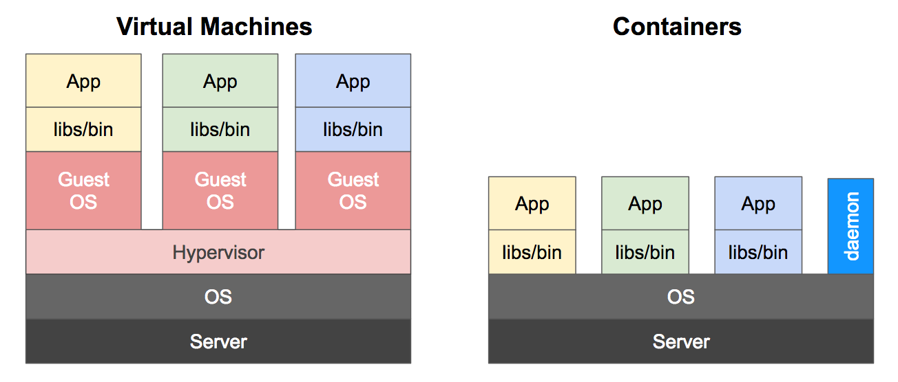

# Introducción

## Una breve introducción a los contenedores

Una imagen en Docker, es una plantilla con todo lo necesario para correr una aplicación; incluyendo los binarios, sus librerías, variables de entorno y archivos de configuración.

Un contenedor es una instancia de una imagen corriendo en memoria. Por defecto se ejecuta completamente isolado del entorno, solo pudiendo acceder a los archivos y puertos si es que es configurado.

Los contenedores corren aplicaciones nativamente en el kernel del host. Tienen mejor rendimiendo que las máquinas virtuales que solo tienen acceso virtual a los recursos del host mediante el hypervisor. Los contenedores pueden tener acceso nativo, cada uno uno corriendo en un proceso discreto, sin consumir más memoria que otro ejecutable.

## Contenedores vs. maquinas virtuales

Veamos este diagrama comparando máquinas virtuales con contenedores:

 

Una máquina virtual es un sistema operativo completo funcionando de manera aislada en otro sistema operativo. Esta tecnología permite compartir hardware de modo que lo puedan usar varios sistemas operativos al mismo tiempo. Esto requiere muchos recursos, la imagen de disco y el estado de aplicación resultantes es un enredo de configuraciones del sistema operativo, dependencias instaladas, parches de seguridad y otras efímeras facil de perder y dificil de replicar.

Los contenedores pueden compartir recursos del propio sistema operativo donde se ejecutan. La única información que necesitan para correr es el ejecutable y sus dependencias, que no son instaladas en el sistema host. Estos contenedores corren como procesos nativos y se pueden manejar indivudualmente con comandos como docker ps, exactamente igual si corrieramos ps en Linux para ver los procesos activos.  Finalmente, como los contenedores ya contienen todas sus dependencias, una app dockerizada “corre en cualquier lado“.

## Docker

Docker es una plataforma para desarrollar, transportar y correr aplicaciones. Permite separar tus aplicaciones de tu infraestructura, por lo que podrás entregar software rapidamente. 

Docker ofrece un set de herramientas y aplicacione para manejar el ciclo de vida de tus contenedores

 

En la siguiente sección vamos explorar la mayoría de estas herramientas haciendo foco en el uso diario de Docker.

Ya estamos listos! Eso fue solo una introducción, así que [vamos a la siguiente sección](https://github.com/fredomartinez/hello-docker/tree/master/1-running-containers).
